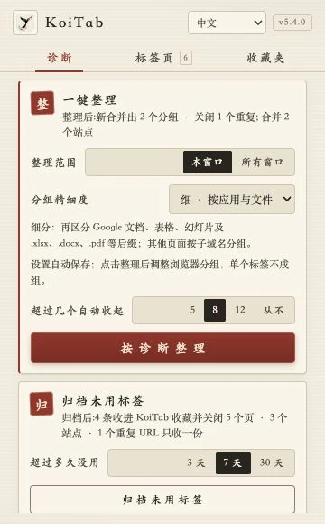
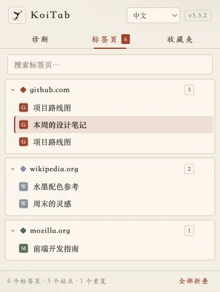
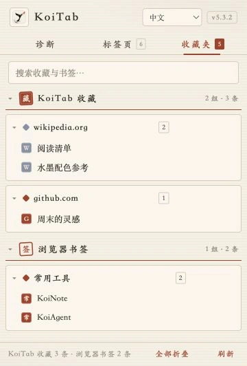

# KoiTab

让纷繁的标签页，归于有序。KoiTab 是一款水墨风的 **Chrome / Edge 标签页整理插件**。

**[⬇ 下载最新版插件（ZIP）](https://github.com/moutsea/koitab/releases/latest/download/koitab-latest.zip)**

[官网](https://koitab.com/zh) · [所有版本](https://github.com/moutsea/koitab/releases) · [使用指南](https://koitab.com/zh/guide)

## 能做什么

- **先诊断，再整理**：查看重复、分散和长期未用的标签，提前了解整理与归档的结果。
- **一键整理**：粗 / 中 / 细三档分组，可区分 Gmail、Google 文档与表格、Excel / PDF 等文件；批量跨窗口归并，清理完整网址相同的重复页。
- **取消分组**：在插件里取消单个或全部浏览器分组，所有标签页保持打开。
- **暂存闲置页面**：将超过 3 / 7 / 30 天未用的标签先保存到本地收藏，再关闭；固定和正在浏览的标签会保留。
- **快速找回**：按标题或网址搜索，折叠站点分组，在收藏夹重新打开保存的链接；浏览器书签只读展示。
- **五种语言**：中文、English、日本語、한국어、Latina，自动跟随浏览器，也可手动切换。
- **本地运行**：无需账号，不上传标签或收藏，支持浅色与深色界面。

## 看看界面

截图来自实际插件界面的浏览器渲染，使用示例标签与收藏。

| 诊断与整理预览 | 分组管理与搜索 | 收藏与浏览器书签 |
| --- | --- | --- |
|  |  |  |

## 安装

支持 **Chrome 121+ / Edge 121+**，目前通过 ZIP 安装：

1. [下载打包好的插件](https://github.com/moutsea/koitab/releases/latest/download/koitab-latest.zip)并解压，保留 `koitab` 文件夹，无需下载整个源码仓库。
2. 打开 `chrome://extensions` 或 `edge://extensions`，开启**开发者模式**。
3. 点击**加载已解压的扩展程序**，选择该文件夹，再将 KoiTab 固定到工具栏。

也可从[官网备用下载](https://koitab.com/downloads/koitab-latest.zip)。

更新时替换原目录内的文件，然后在扩展管理页点击刷新。不要先卸载，以免丢失本地收藏。

收藏保存的是网页链接，不是离线快照；整理前请保存正在编辑的内容。

## 参与开发

扩展本体无需构建，直接加载仓库中的 `extension/` 即可。欢迎提交 Issue 和 Pull Request。

[开发与发布说明](docs/DEVELOPMENT.md) · [更新日志](CHANGELOG.md) · [MIT 许可证](LICENSE)
